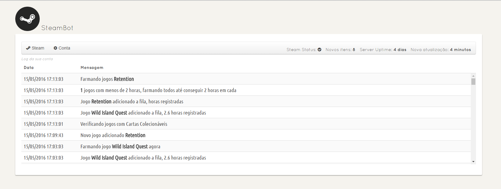
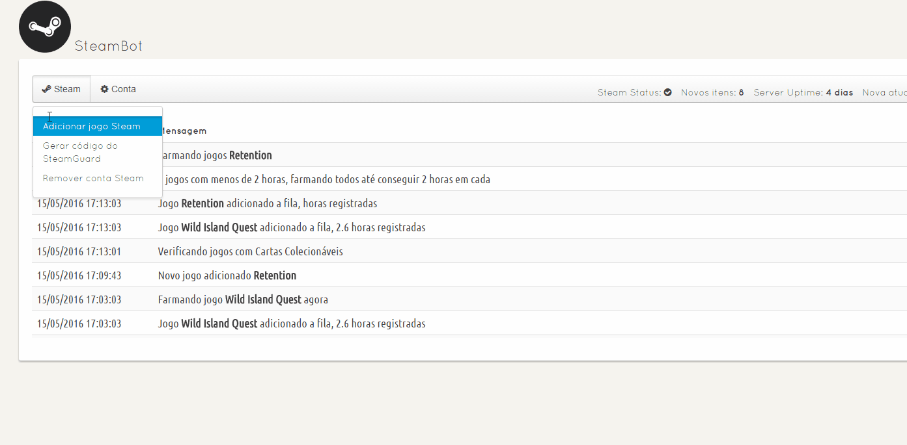

### NinjaBot-Steam
-----

Simple `NodeJS` Bot to Idle Steam Games with trading cards.

## Preview

## How to use

First install all the dependencies
`npm install`

To start the bot just use

`sudo ./start.sh`

You have to host the website version of the bot as well.
To do so you can use Apache or Nginx.

Just make sure that you are hosting the web server on the same server that the bot is running, if you are not hosting on the same server just change the js/global.js file on the `socket.connect` to match the right ip address of the server with the bot.

